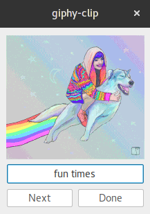

# giphy_clip

An easy way to find a gif for any situation. Quickly search a gif and stick it
in your clipboard. Requires PyQt4 to already be installed

## Usage

* Type the thing you want
* Smack enter or the next button until you see what you like
* hit Ctrl-c or click done
* Paste into your chat

